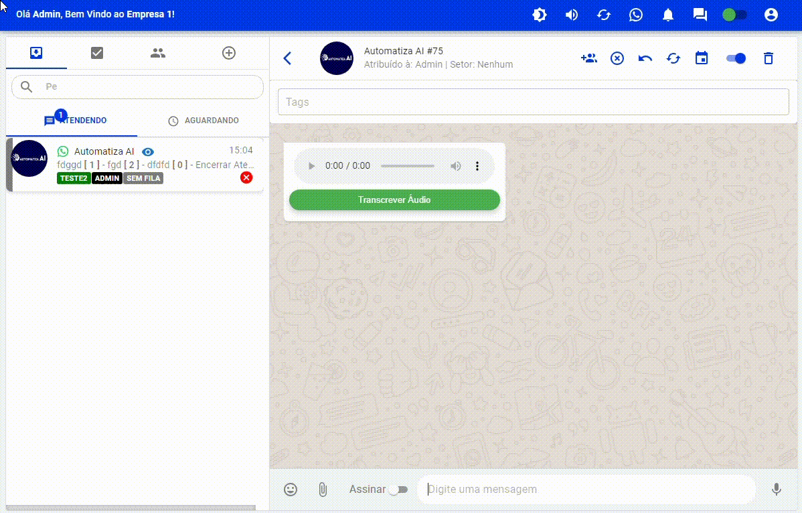

<h1>Whaticket Saas</h1>

<h3>Instalação</h3>

Ubuntu 20.04

Debian 11

<code>apt update && apt upgrade -y && apt install sudo git -y && sudo rm -rf Whaticket-Saas-Completo && sudo git clone https://github.com/andrew890074/Whaticket-Saas-Completo.git && cd Whaticket-Saas-Completo && sudo chmod +x ./automatizaai && ./automatizaai</code> 
&nbsp;

<h3>Whatsapp Suporte: +55 (51) 99705-8551<h3>

<h3>Seja um revendedor desse sistema chame no Whatsapp: +55 (21) 95915-5530<h3>

 

## Principais Funcionalidades

- 🔊 <strong>Transcrever Áudios:<strong> Converta áudios recebidos em texto.  
- 🌟 <strong>Atendimento Organizado:<strong> Adicione vários atendentes e defina por setores para uma gestão organizada.  
- 📲 <strong>Adicionar Participantes:<strong> Integre novos participantes facilmente em conversas existentes.  
- 📢 <strong>Campanhas Personalizadas:<strong> Crie campanhas com agendamento e utilize variáveis para comunicações personalizadas.  
- 🗓️ <strong>Agendamento Recorrente:<strong> Automatize o envio de mensagens agendadas por contatos.  
- 🤖 <strong>Chatbot Inteligente:<strong> Configure seu chatbot por setor para respostas automatizadas.  
- 📁 <strong>Envio de Arquivos:<strong> Compartilhe imagens, vídeos, documentos e áudios de forma prática.  
- 📈 <strong>Gerenciamento de Leads:<strong> Capture leads automaticamente ao receberem contato.  
- ✉️ <strong>Mensagens Rápidas:<strong> Crie mensagens pré-configuradas para respostas ágeis.  
- 🏷️ <strong>Tags Personalizadas:<strong> Adicione tags para um melhor gerenciamento e organização.  
- 💼 <strong>Integração Financeira: Integre com<strong> sistemas de gestão financeira para uma visão completa.  
- 🏢 <strong>Gerenciamento Empresarial:<strong> Cadastre múltiplas empresas para uma gestão ampla.  

## Funcionalidades Via Api

- Enviar Mensagens ✅
- Criar Empresas ✅
- Criar Contatos ✅
- Listar Contatos ✅
- Atualizar Contatos ✅
- Excluir Contatos ✅
- Criar Tags ✅
- Listar Tags ✅
- Excluir Tags ✅
- Criar Agendamento ✅
- Listar Agendamento ✅
- Excluir Agendamento ✅

<h1>Demonstração</h1>

